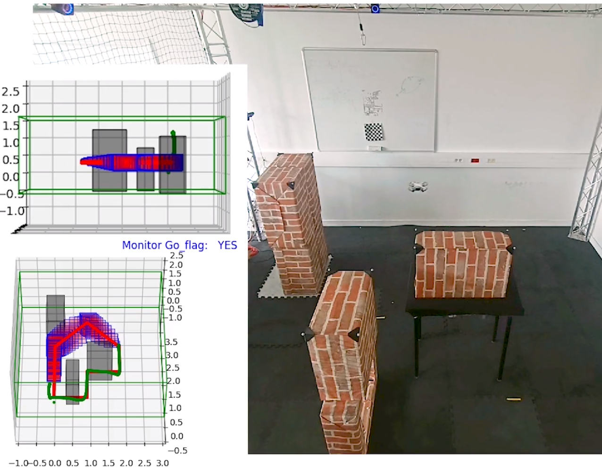

The paper shows how to **predict and verify** a robot’s near-future behavior **with guarantees** and **in real time**. By simulating **set-valued tubes** under bounded uncertainties and checking an **STL spec** using **Boolean intervals**, the monitor returns **YES/NO/MAYBE** in a sound way. It runs as a **ROS node**, works on a drone experiment, and is **faster than Monte-Carlo** while enclosing it—making it a practical, safety-minded way to monitor robots with timing requirements.&#x20;

Welcome ! This is a prototype for the verification of STL formula on reachable tube using Dynibex. It has been tested on Linux Ubuntu only.
It uses DynIbex.

Install Dynibex:
https://perso.ensta-paris.fr/~chapoutot/dynibex/index.php#download-installation

In recent Ubuntu versions you might need to do the the install in a python 2.7 virtual environement and :
sudo CXXFLAGS="-std=c++14" ./waf configure
sudo CXXFLAGS="-std=c++14" ./waf install

If dynibex is a local install add to the make file:
export PKG_CONFIG_PATH='path_to_dynibex'/share/pkgconfig 

Make the code:
Open terminal in the CSTL directory and compile using make:
make

Run:
./simulation.out

If everything works correctly, the output should be:
(Satisfaction value, [time interval[)
(1, [0, 1[)
([0,1], [1, 10[)

**************Important*************
Moniteur MP is the monitoring algorithm, asservissement_PI is the control node of the DJI Tello. Use ROS 1!
Position measurement is performed using an optitrack with natnet_ros node
************************************

## STL Formula Verification

Verification is performed bottom-up using the syntax tree of the formula and satisfaction signals.

Supported operators:

```
phi1 = neg_stl(phi);                        // Logical negation: ¬phi
phi1 = and_stl(phi2, phi3);                 // Logical AND: phi2 ∧ phi3
phi1 = or_stl(phi2, phi3);                  // Logical OR: phi2 ∨ phi3
phi1 = until_stl(phi2, phi3, {t1, t2});     // Until operator: phi2 U[t1,t2] phi3
phi1 = Finally(phi, {t1, t2});              // Eventually operator: F[t1,t2] phi
phi1 = Globally(phi, {t1, t2});             // Always operator: G[t1,t2] phi
```

Predicate satisfaction:

```
predicate_satisfaction(sim, predicates);
```

This constructs satisfaction signals for a list of predicates and the simulation object.
The output is a list of signals corresponding to each predicate.

Display signals:

```
print_Satisf_Signals(phi);
```

This displays the satisfaction signal of a given formula.

****************
Image: Experiment with predicted set of trajectory and monitor flag.
<p align="center">
  
</p>


# What problem are we solving?

Robots (here: a drone) must obey **state** rules (“stay in the safe zone, avoid obstacles”) **and timing** rules (“do X within Y seconds”), even when the model and sensors are uncertain. You want **real-time guarantees** about future behavior—not just likely outcomes.&#x20;

# Core idea (one sentence)

Predict **all** possible futures over a short horizon as **set-valued tubes**, then check an **STL** (Signal Temporal Logic) spec on those sets using **Boolean intervals**: the monitor outputs **YES (1)**, **NO (0)**, or **MAYBE (\[0,1])** with guarantees.&#x20;

---

## The ingredients

* **Tubes (validated sets over time).** Using DynIbex, you integrate the ODE with interval arithmetic so each time slice encloses all trajectories consistent with bounded uncertainties. Stack those slices and you get a “tube” \[ỹ]\(t). This is **guaranteed** (worst-case) reachability over the chosen horizon.&#x20;

* **STL (logic with timing).** You write specs like “always stay in the safe set for the next N·τ seconds” or “if you reach waypoint p, then eventually park within \[c,d] seconds.” Temporal operators (`G`, `F`, `U`) come with **explicit time bounds**.&#x20;

* **Boolean intervals.** Because you evaluate predicates on **sets**, truth may be **undetermined**: neither all true nor all false. Logic is lifted to intervals `{0, 1, [0,1]}` so uncertainty is handled soundly and propagates up the formula only when necessary.&#x20;

* **Sliding horizon.** Keep predicting the next *h* seconds as the robot moves, recomputing often (at a fixed rate). That keeps predictions fresh and limits conservatism.&#x20;

* **ROS node.** You ship this as a ROS Melodic node that subscribes to state (e.g., OptiTrack at \~2 mm, up to 100 Hz) and commands (DJI Tello driver), runs the guaranteed prediction, and publishes a **3-valued flag** (YES/NO/MAYBE).&#x20;

---

## What the monitor actually checks (example)

A simple reach-avoid STL spec:

```
ϕflag = G[0,N·τ] ¬μ_collision  ∧  G[0,N·τ] μ_env
```

“Always avoid obstacles and always stay inside the flight zone over the horizon.” Predicates are evaluated over tubes via **inclusion** (“the whole tube is inside Xµ → 1”) and **disjointness** (“the tube doesn’t intersect Xµ → 1”); mixed cases give **\[0,1]**.&#x20;

You also show a richer example with waypoints and deadlines:

```
ϕflag2 = ( G[0,N·τ](¬μc ∧ (μp ⇒ F[c,d] μf)) ) ∧ ( μe U[a,b] μp )
```

(avoid obstacles, stay in zone, if you hit p then reach f within \[c,d], and remain in e until p within \[a,b]).&#x20;

---

## What’s actually new here?

1. A **real-time** STL monitor that reasons over **uncertain models** using guaranteed tubes and Boolean intervals without being only "theoretical approach".
2. A **ROS implementation** ready for sim and real robots.
3. An empirical **comparison to Monte-Carlo** showing you can get **guarantees** at practical speeds.&#x20;

---

## Practical notes & limits

* The **horizon length** should match the STL time bounds: too short → you can’t decide; too long → tubes can over-inflate (conservative). Sliding horizons help balance this.&#x20;
* First-order vs second-order: 1st is faster but more conservative; 2nd is tighter but heavier.* 
---
